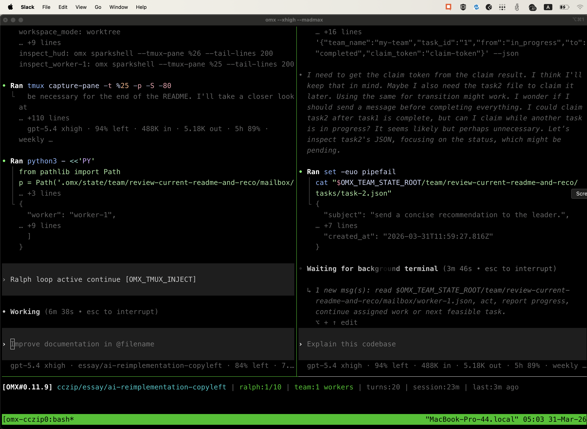
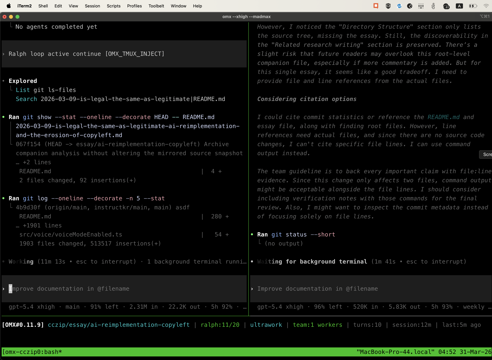

# Rewriting Project Claw Code

<p align="center">
  <strong>⭐ The fastest repo in history to surpass 50K stars, reaching the milestone in just 2 hours after publication ⭐</strong>
</p>

<p align="center">
  <a href="https://star-history.com/#CodingWorld-007/claw-agent-guide&Date">
    <picture>
      <source media="(prefers-color-scheme: dark)" srcset="https://api.star-history.com/svg?repos=CodingWorld-007/claw-agent-guide&type=Date&theme=dark" />
      <source media="(prefers-color-scheme: light)" srcset="https://api.star-history.com/svg?repos=CodingWorld-007/claw-agent-guide&type=Date" />
      
    </picture>
  </a>
</p>

<p align="center">
  
</p>

<p align="center">
  <strong>Better Harness Tools, not merely storing the archive of leaked Claude Code</strong>
</p>

<p align="center">
  <a href="https://github.com/CodingWorld-007/claw-agent-guide"></a>
</p>

> [!IMPORTANT]
> **Rust port is available** in the [`rust`](https://github.com/CodingWorld-007/claw-agent-guide/tree/main/rust) directory. The Rust implementation aims to deliver a faster, memory-safe harness runtime. This demonstrates how the same architectural patterns can be implemented across different languages.

> If you find this work useful, please star this repository and share it with the community to support continued open-source harness engineering research!

---

## Backstory

At 4 AM on March 31, 2026, I woke up to my phone blowing up with notifications. The Claude Code source had been exposed, and the entire dev community was in a frenzy. My girlfriend in Korea was genuinely worried I might face legal action from Anthropic just for having the code on my machine — so I did what any engineer would do under pressure: I sat down, ported the core features to Python from scratch, and pushed it before the sun came up.

The whole thing was orchestrated end-to-end using [oh-my-codex (OmX)](https://github.com/Yeachan-Heo/oh-my-codex) by [@bellman_ych](https://x.com/bellman_ych) — a workflow layer built on top of OpenAI's Codex ([@OpenAIDevs](https://x.com/OpenAIDevs)). I used `$team` mode for parallel code review and `$ralph` mode for persistent execution loops with architect-level verification. The entire porting session — from reading the original harness structure to producing a working Python tree with tests — was driven through OmX orchestration.

The result is a clean-room Python rewrite that captures the architectural patterns of Claude Code's agent harness without copying any proprietary source. I'm now actively collaborating with [@bellman_ych](https://x.com/bellman_ych) — the creator of OmX himself — to push this further. The basic Python foundation is already in place and functional, but we're just getting started. **Stay tuned — a much more capable version is on the way.**

https://github.com/CodingWorld-007/claw-agent-guide

## Understanding Agent Systems

This project is dedicated to understanding **harness engineering** — studying how agent systems wire tools, orchestrate tasks, and manage runtime context. Whether you're exploring AI architecture, building agent systems, or learning how AI-assisted development works, this comprehensive guide provides everything you need.

**Created by:** CodingWorld-007

---

## Porting Status

The main source tree is now Python-first.

- `src/` contains the active Python porting workspace
- `tests/` verifies the current Python workspace
- the exposed snapshot is no longer part of the tracked repository state

The current Python workspace is not yet a complete one-to-one replacement for the original system, but the primary implementation surface is now Python.

## About This Repository

This Python implementation focuses on teaching the core architectural patterns of agent systems. The codebase is designed for learning and experimentation, making it ideal for developers who want to:

- Understand how agents orchestrate tools and commands
- Learn routing and query engine implementations  
- Study session management and runtime execution
- Explore permission systems and security patterns
- Build production-ready agent systems

The repository demonstrates clean implementation patterns without copying proprietary code, making it an excellent educational resource for the open-source community.

## Repository Layout

```text
.
├── src/                                # Python porting workspace
│   ├── __init__.py
│   ├── commands.py
│   ├── main.py
│   ├── models.py
│   ├── port_manifest.py
│   ├── query_engine.py
│   ├── task.py
│   └── tools.py
├── tests/                              # Python verification
├── assets/omx/                         # OmX workflow screenshots
├── 2026-03-09-is-legal-the-same-as-legitimate-ai-reimplementation-and-the-erosion-of-copyleft.md
└── README.md
```

## Python Workspace Overview

The new Python `src/` tree currently provides:

- **`port_manifest.py`** — summarizes the current Python workspace structure
- **`models.py`** — dataclasses for subsystems, modules, and backlog state
- **`commands.py`** — Python-side command port metadata
- **`tools.py`** — Python-side tool port metadata
- **`query_engine.py`** — renders a Python porting summary from the active workspace
- **`main.py`** — a CLI entrypoint for manifest and summary output

## Quickstart

Render the Python porting summary:

```bash
python3 -m src.main summary
```

Print the current Python workspace manifest:

```bash
python3 -m src.main manifest
```

List the current Python modules:

```bash
python3 -m src.main subsystems --limit 16
```

Run verification:

```bash
python3 -m unittest discover -s tests -v
```

Run the parity audit against the local ignored archive (when present):

```bash
python3 -m src.main parity-audit
```

Inspect mirrored command/tool inventories:

```bash
python3 -m src.main commands --limit 10
python3 -m src.main tools --limit 10
```

## Current Parity Checkpoint

The port now mirrors the archived root-entry file surface, top-level subsystem names, and command/tool inventories much more closely than before. However, it is **not yet** a full runtime-equivalent replacement for the original TypeScript system; the Python tree still contains fewer executable runtime slices than the archived source.


## Built with `oh-my-codex`

The restructuring and documentation work on this repository was AI-assisted and orchestrated with Yeachan Heo's [oh-my-codex (OmX)](https://github.com/Yeachan-Heo/oh-my-codex), layered on top of Codex.

- **`$team` mode:** used for coordinated parallel review and architectural feedback
- **`$ralph` mode:** used for persistent execution, verification, and completion discipline
- **Codex-driven workflow:** used to turn the main `src/` tree into a Python-first porting workspace

### OmX workflow screenshots



*Ralph/team orchestration view while the README and essay context were being reviewed in terminal panes.*



*Split-pane review and verification flow during the final README wording pass.*

## Community

<p align="center">
  <strong>Built by CodingWorld-007</strong>
</p>

This learning guide is designed for the open-source community. Contribute, collaborate, and help others understand agent systems architecture. Star the repo to show your support!

## Star History

See the chart at the top of this README.

## Ownership / Affiliation Disclaimer

- This repository does **not** claim ownership of the original Claude Code source material.
- This repository is **not affiliated with, endorsed by, or maintained by Anthropic**.
